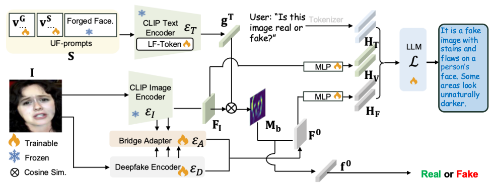

# Rethinking Vision-Language Model in Face Forensics: Multi-Modal Interpretable Forged Face Detector

<div align="center">
  
[](https://arxiv.org/abs/2503.20188) 
[](./LICENSE) 
[](https://huggingface.co/CHELSEA234/llava-v1.5-7b-M2F2-Det)
<br>

[](https://m2f2-net.github.io/M2F2-Page/)

</div>
  
This repository contains the implementation and datasets for the paper: Rethinking Vision-Language Model in Face Forensics: Multi-Modal Interpretable Forged Face Detector. 

The paper ([ArXiv](https://arxiv.org/pdf/2503.20188)) is presented in CVPR 2025 (Oral), and our [project page](https://m2f2-net.github.io/M2F2-Page/) is available. 

<details>
<summary>Abstract</summary>
  
> Deepfake detection is a long-established research topic vital for mitigating the spread of malicious misinformation.
Unlike prior methods that provide either binary classification results or textual explanations separately, we introduce a novel method capable of generating both simultaneously. Our method harnesses the multi-modal learning
capability of the pre-trained CLIP and the unprecedented
interpretability of large language models (LLMs) to enhance both the generalization and explainability of deepfake detection. Specifically, we introduce a multi-modal
face forgery detector (M2F2-Det) that employs tailored
face forgery prompt learning, incorporating the pre-trained
CLIP to improve generalization to unseen forgeries. Also,
M2F2-Det incorporates an LLM to provide detailed textual explanations of its detection decisions, enhancing interpretability by bridging the gap between natural language
and subtle cues of facial forgeries. Empirically, we evaluate M2F2-Det on both detection and explanation generation tasks, where it achieves state-of-the-art performance,
demonstrating its effectiveness in identifying and explaining diverse forgeries.

</details>

<p align="center">
  
</p>

## Updates
* **[2025.07.10]** 🎉🎉🎉 Our [project page](https://m2f2-net.github.io/M2F2-Page/) is available.~
* **[2025.06.13]** 🎉🎉🎉 The first version of the code is released. See you at CVPR25.~

## Setup
### Dataset

**FF++**: We offer a preprocessed FF++ dataset in the HDF5 file format [Google Drive](https://drive.google.com/drive/folders/1ovuurFCkBfmcMq7HKO5ph36U1QyL75UA?usp=sharing). The dataset consists of approximately $300$ GB of data for compression levels c23 and c40, following the naming convention ```FF++_{manipulation_type}_{compression rate}.h5```. Each file is structured as follows:
```
FF++_Deepfakes_c23.h5:
FF++_Deepfakes_c40.h5
FF++_Face2Face_c23.h5
FF++_Face2Face_c40.h5
```

**FF++ (test only)**: To quickly evaluate the detection performance, one can obtain the FF++_test_only version (around $6.7$ G) from [[Google Drive]](https://drive.google.com/file/d/1tQ0ZwsXXX-K9aWYhn_ELLgViP-T4MC70/view?usp=drive_link).

   
**DDVQA**: we have provide a c40 version DDVQA in ```utils/DDVQA_images/c40.zip``` or one can download it from the DDVQA's [[Project Page]](https://github.com/Reality-Defender/Research-DD-VQA).

### Environment
We build on the environment based on LLaVA-v1.5, such as ```pytorch==2.0.1+cu117 torchvision==0.16.2```. It can be created by
```bash
conda env create -f environment.yml
```

## Usage and Inference

First, please download the pre-trained CLIP image encoder of LLaVA and put it in `utils/weights`: [[Google Drive]](https://drive.google.com/file/d/19oEpKB96xJVSrwkLV0ewje-W2dfBAR58/view?usp=drive_link).

#### Detection performance: 
Download **FF++ (test only)** and moify this [line](./stage_1_detection_inference.py#L145). Then put M2F2-Det's detector-only weights [[Google Drive]](https://drive.google.com/file/d/1X1ZUZkCwqg9mrsqoOS0EoO3v5WABNBAw/view?usp=drive_link) in`checkpoints/stage_1` and run:

```bash
bash stage_1_inference.sh
```

#### Explanation performance:
Run the eval code as follows to get the numerical scores on our pre-cached results:
```bash
python eval/eval_judgement.py
python eval/eval_explanation.py
```

First please unzip ```utils/DDVQA_images/c40.zip``` and put M2F2-Det weights [[Hugging Face]](https://huggingface.co/CHELSEA234/llava-v1.5-7b-M2F2-Det) under ```checkpoints```:
```bash
cd checkpoints
git lfs clone https://huggingface.co/CHELSEA234/llava-v1.5-7b-M2F2-Det
cd ..
bash stage_3_inference_det.sh  ## results into outputs/DDVQA/DDVQA_det_c40.jsonl 
bash stage_3_inference_exp.sh  ## results into outputs/DDVQA/DDVQA_exp_c40.jsonl 
```

## Gradio Demo:
We set up our demo based on the awesome LLaVA repos at [link](https://github.com/haotian-liu/LLaVA?tab=readme-ov-file#demo).

To launch a Gradio demo locally, please run the following commands one by one.

1. Launch a controller
`python -m llava.serve.controller --host 0.0.0.0 --port 10000
`

2. Launch a gradio web server
`python -m llava.serve.gradio_web_server --controller http://localhost:10000 --model-list-mode reload
`

3. Launch a model worker
`python -m llava.serve.model_worker --host 0.0.0.0 --controller http://localhost:10000 --port 40000 --worker http://localhost:40000 --model-path $M2F2-Det_checkpoint$
`

4. For a better user experience, please first check out cropped images from ```utils/DDVQA_images/``` with the prompt "**Determine the authenticity of this image**".

## Train 

#### Stage-1: A Binary Detector Training.
After setting up the dataset and environment, please run the following command, which produces **Stage-1-weights** (pre-trained binary detector weights in ```*.pth```). 

```bash
bash stage_1_train.sh
```

<details>
<summary>Note</summary>
  
  1. The pre-trained CLIP image encoder is the `vision_tower.pth`, which must match the LLaVA version used, and LLaVA's CLIP encoder differs from the one imported `CLIP transformers`. If using a new CLIP-based model, load weights from LLaVA's pretrained models from scratch~

  2. In `M2F2Det/models/model.py`, preprocessing is defined in the `forward()` function without additional pipeline preprocessing. This originates from LLaVA's preprocessing flow. New models must use identical preprocessing here to ensure input consistency when integrated into LLaVA.
</details>

#### Stage-2: Multi-Modal Alignment.

```bash
bash stage_2_train.sh
```

<details>
<summary>Initialization</summary>
  
We merge **LLaVA-1.5-7b** and **Stage-1 weights** to initialize **LLaVADeepfakeCasualLM**, which needs to modify `config.json` of the base model (_i.e._, LLaVA-1.5-7b) as follows:
  
```json
{
  "_name_or_path": "LLaVA-1.5-7b",
  ...
  "deepfake_model_name": "densenet121",  // Detector type, we provide the code base for densenet and efficient. 
  "deepfake_model_path": "/path/to/your/Stage-1 weights, such as efficient and densenet weights", 
  "mm_vision_select_feature": "cls_patch",  // Changed from 'patch' to 'cls_patch'
  ...
}
```

We offer an available template and required pre-trained weights in [Google Drive](https://drive.google.com/drive/folders/1H0KcBQDu9-L0DMz0d66z1rabIy3FpGIH?usp=sharing). Also, it is also helpful to set ```low_cpu_mem_usage=False``` in around ```LLaVA/model/builder.py```#L246.
</details>

<details>
<summary>Train MLP layers</summary>
  
Run the following code to randomly initialize specific MLP layers, which produces **Stage-2-init-weights**. This merging code is
  
```bash
python scripts/merge_lora_weights_deepfake_random.py \
  --model-path LLaVA-1.5-7b-with-updated-config \
  --save-model-path new_model_path
```

Using **Stage-2-init-weights**, the following trains MLP layers and results in **Stage-2-weights-Delta**.
```bash
bash scripts/finetune_stage_2.sh
```

Key parameters to modify in the script:
  
```bash
--model_name_or_path    # Stage-2-init-weights
--data_path             # Training data JSON
--image_folder          # Base path prefix for "image" keys in data
--vision_tower          # CLIP path (we use openai/clip-vit-large-patch14-336.)
--deepfake_ckpt_path    # Pretrained detector weights, check *.pth from Stage-1-weights.
--output_dir            # Output directory for Stage-2-weights-Delta.
```
</details>

<details>
<summary>Merging</summary>
  
After fine-tuning, the follow code merges **Stage-2-weights-Delta** with **Stage-2-init-weights** into **Stage-2-weights** as:

```
python scripts/merge_lora_weights_deepfake.py
  --model_path Stage-2-weights-Delta \
  --model_base Stage-2-init-weights \
  --save_path your_path
```
</details>

#### Stage-3: LoRA Finetuning.

```bash
bash stage_3_train.sh
```

<details>
<summary>LoRA</summary>
  
Using the **Stage-2-weights**, the following command conducts the LoRA fine-tuning to generate **Stage-3-weights-Delta**. 
```bash
bash scripts/finetune_stage_3.sh
```

Key parameters to modify in the script:
  
```bash
--model_name_or_path    # Stage-2-weights
--output_dir            # Output directory for Stage-3-weights-Delta.
```
[more defined parameters](#key1)
</details>

<details>
<summary>Merging</summary>

After training, we merge **Stage-3-weights-Delta** into **M2F2-Det** for the inference, as:

```bash
python scripts/merge_lora_weights_deepfake.py \
  --model_path Stage-3-weights-Delta \
  --model_base Stage-2-weights \
  --save_path your_path
```
</details>

### Reference
If you would like to use our work, please cite:
```Bibtex
@inproceedings{ M2F2_Det_xiao,
  author = { Xiao Guo and Xiufeng Song and Yue Zhang and Xiaohong Liu and Xiaoming Liu },
  title = { Rethinking Vision-Language Model in Face Forensics: Multi-Modal Interpretable Forged Face Detector },
  booktitle = {Computer Vision and Pattern Recognition },
  year = { 2025 },
}

@inproceedings{ DDVQA,
  title={Common sense reasoning for deepfake detection},
  author={Zhang, Yue and Colman, Ben and Guo, Xiao and Shahriyari, Ali and Bharaj, Gaurav},
  booktitle={European Conference on Computer Vision},
  year={2024}
}
```
